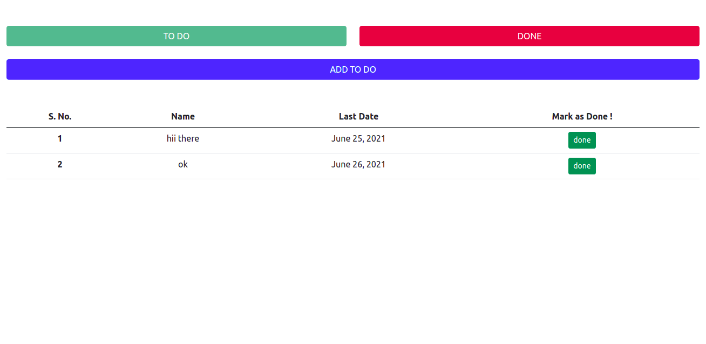

<h3 align="center">Todo App Django</h3>

---

## 📝 Table of Contents

- [About](#about)
- [Getting Started](#getting_started)
- [Built Using](#built_using)

## 🧐 About <a name = "about"></a>

A simple Todo App in Django

<p align="center">
 
</p>

## 🏁 Getting Started <a name = "getting_started"></a>

- clone project
  ```
  git clone https://github.com/harshraj8843/todo_app_DJANGO
  ```
  ```
  cd todo_app_DJANGO/
  ```
- install requirements
  ```
  pip install -r requirements.txt
  ```
- migrate
  ```
  python manage.py migrate
  ```
- runserver
  ```
  python manage.py runserver
  ```

## ⛏️ Built Using <a name = "built_using"></a>

- [DJANGO](https://www.djangoproject.com/) - Backend Framework
